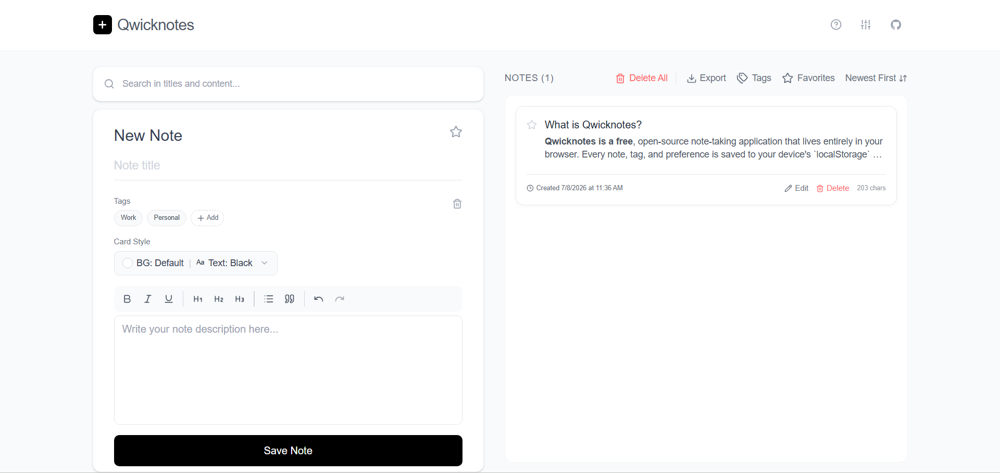

<!-- project logo -->
<p align="center">
  
</p>

<h1 align="center">Qwicknotes</h1>

<p align="center">
  <strong>Notes that stay on your device.</strong><br />
  A minimalist, browser-based note-taking app with a rich-text editor, tags, favorites, and instant search – all stored locally.
</p>

<p align="center">
  <a href="./LICENSE">
    
  </a>
  
  
  
  <a href="https://github.com/byllzz">
    
  </a>
  
  
</p>

<p align="center">
  <a href="https://qwicknotes.vercel.app">
    
  </a>
</p>

<p align="center">
  
</p>

---

## What is Qwicknotes?

**Qwicknotes** is a free, open-source note-taking application that lives entirely in your browser. Every note, tag, and preference is saved to your device's `localStorage` – no servers, no sign‑up, no cloud.

Write with a rich‑text editor, organise with tags and favourites, search instantly, and export your notes in multiple formats. Whether you're jotting down quick ideas, maintaining a personal knowledge base, or planning your next project, Qwicknotes gives you a clean, fast, and private workspace.

## Why Qwicknotes?

Most note‑taking apps store your data in the cloud – which raises privacy concerns, requires an account, and often costs money. Qwicknotes is different:

-  **100% local** – Your notes never leave your device.
-  **Instant** – No loading, no waiting, no sync delays.
-  **Simple** – Clean interface, no clutter.
-  **Offline‑ready** – Works without an internet connection.
-  **Open source** – Transparent, free, and community‑driven.

Whether you're a writer, student, developer, or anyone who takes notes, Qwicknotes adapts to your flow – not the other way around.

---

## Features

###  Rich‑Text Editor
Powered by **TipTap** – bold, italic, underline, headings (H1–H3), bullet lists, blockquotes, undo/redo. All formatting is preserved in your notes.

###  Colourful Cards
Choose a background colour, a text colour, or pick from **8 curated gradients** – your notes look exactly how you want them to.

###  Tags & Favourites
- Create, delete, and manage tags globally.
- Click a tag to filter all notes by it.
- Star important notes and toggle the **Favorites** filter to see only them.

###  Instant Search
Search across note titles and content in real‑time – results appear as you type.

###  Sorting
Sort your notes by:
- Newest / Oldest first
- Recently updated
- Largest / Smallest size (character count)
- Title (A‑Z or Z‑A)

###  Export Options
- **Single note** – download as `.txt`, `.md`, or `.pdf`.
- **All notes (bulk)** – download as a single `.txt`, `.md`, or `.pdf`, or as a `.zip` archive containing individual `.txt` files.
- **Individual selection** – open the Individual Export modal to choose specific notes by tag or filter.

###  Dark Mode
Toggle between light and dark themes – your preference is saved automatically.

###  Persistent Storage
All notes, tags, editor drafts, search queries, sort preferences, filter states, and the current editing note are saved to `localStorage`. Close the tab, come back later – everything is exactly where you left it.

###  Guided Tour
First‑time users get a step‑by‑step tour that highlights key parts of the interface. You can also reopen the tour anytime from the header.

###  Keyboard Shortcuts
- `Enter` to advance the tour (when open).
- All standard rich‑text editor shortcuts (e.g., `Ctrl+B` for bold) are supported.

---

## How to Use

| Action | How to do it |
|--------|--------------|
| **Create a note** | Type a title and content in the left panel, then click **Save Note** |
| **Edit a note** | Click the **Edit** button on any note card |
| **Delete a note** | Click the **Delete** button on a note card (confirmation required) |
| **Star a note** | Click the star icon on the note card or in the editor |
| **Apply a colour/gradient** | Click **Card Style** in the editor, pick a colour or gradient, then click **Done** |
| **Add a tag** | Click the **Add** button below the title field, type the tag name, and press Enter |
| **Filter by tag** | Click the **Tags** dropdown in the notes list controls |
| **Search notes** | Type into the search bar at the top of the left panel |
| **Sort notes** | Click the sort dropdown in the notes list controls |
| **Export a single note** | Open a note (click its card) → click **Export** → choose format |
| **Export all notes** | Click the **Export** button in the notes list controls → choose bulk option |
| **Delete all notes** | Click the **Delete All** button in the notes list controls (confirmation required) |
| **Toggle dark mode** | Click the slider in the header (☀️/🌙) |
| **Open the tour** | Click the **?** (Help Circle) button in the header |

---

## Tech Stack

| Technology | Purpose |
|------------|---------|
| **React 19** | UI framework |
| **Tailwind CSS v4** | Styling (with dark mode support) |
| **Vite 6** | Build tool |
| **TipTap** | Rich‑text editor (ProseMirror) |
| **Lucide React** | Icons |
| **React Icons** | Additional icons (GitHub, etc.) |
| **jsPDF** | PDF export |
| **JSZip** | ZIP archive generation |

---

## Development

### Prerequisites
- Node.js (v18 or later)
- npm or yarn

### Clone & Install
```bash
git clone https://github.com/byllzz/qwicknotes.git
cd qwicknotes
npm install
```


## Support

If NetPen helps you, consider supporting the project:

- ⭐ Star this repository on GitHub
-  Share it with your friends and community
-  Leave feedback in GitHub Discussions
-  Buy me a coffee


---
  <p align="center">
© 2026 Qwicknotes – Open Source MIT
</p>
